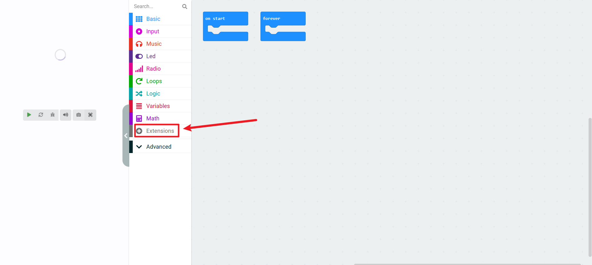
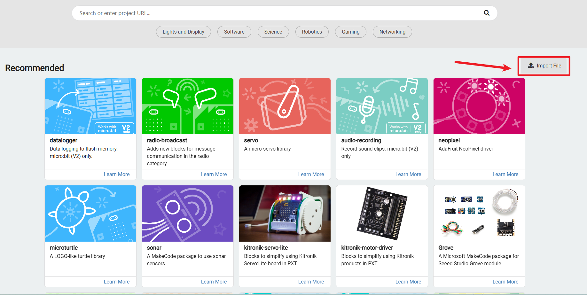

# pxt-offline-extensions

  

## Introduction

Welcome to `pxt-offline-extensions` by Elecfreaks! This repository provides a set of extensions for MakeCode that have been converted into `.hex` files, allowing users who cannot access the online MakeCode editor to use these extensions offline.

## Usage

To use our extensions with the offline MakeCode editor, follow these steps:

1. **Download the `.hex` file**

   Download the desired `.hex` file from this repository. Each extension has its own corresponding `.hex` file, so make sure you select the right one for your needs.

2. **Import the `.hex` file**

   - Open the offline MakeCode editor.

   - Navigate to the "Extensions" page.

     

   - Select "Import File" option.

     

   - Browse and select the downloaded `.hex` file.

3. **Start Programming**

   After completing the above steps, you can now start coding with the new extension!

## Notes

- Ensure that the `.hex` file you download is compatible with your target hardware.
- If you encounter any issues, feel free to open an Issue or Pull Request to help improve this project.
